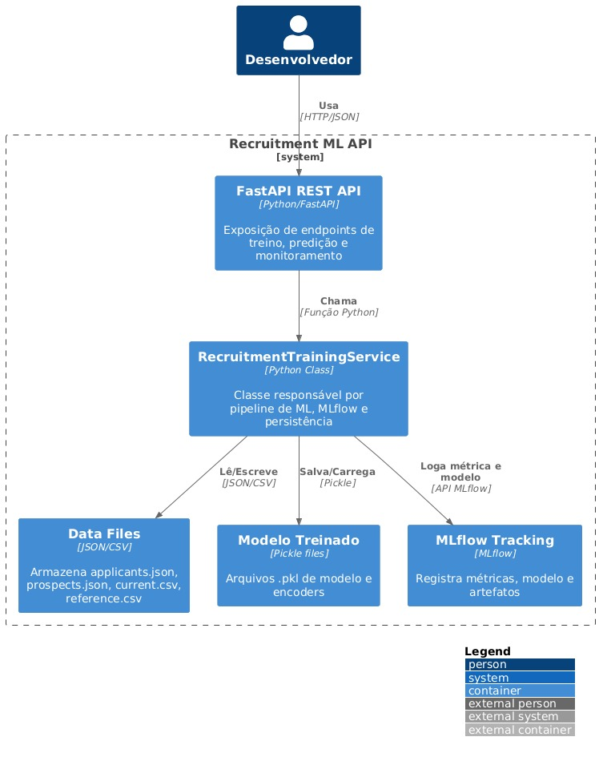

# Tech Challenge 05 <!-- omit in toc -->

- [Como Executar](#como-executar)
  - [Clone o repositório](#clone-o-repositório)
  - [Criar ambiente Python](#criar-ambiente-python)
  - [Ativar ambiente Python](#ativar-ambiente-python)
- [Executar localmente](#executar-localmente)
- [Executando com docker compose](#executando-com-docker-compose)
- [Documentação](#documentação)
- [Arquitetura](#arquitetura)

## Como Executar

### Clone o repositório

```bash
git clone git@github.com:valhallaml/tech-challenge-05.git
cd tech-challenge-05
```

### Criar ambiente Python

```bash
python -m venv .venv
```

### Ativar ambiente Python

```bash
source .venv/bin/activate
```

## Executar localmente

> Antes de executar, copie `.env.sample` e renomeie para `.env`. Substitua as variáveis ​​pelos valores corretos.

```bash
pip install -r requirements.txt
python src/main.py
```

Acesse <http://localhost:8000/>

## Executando com docker compose

```bash
docker compose up --build --force-recreate
```

## Documentação

- <http://localhost:8000/docs>

## Arquitetura


